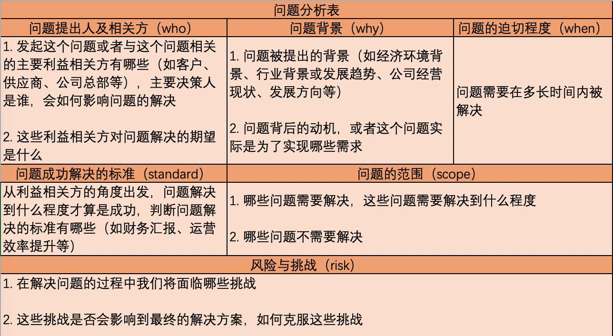
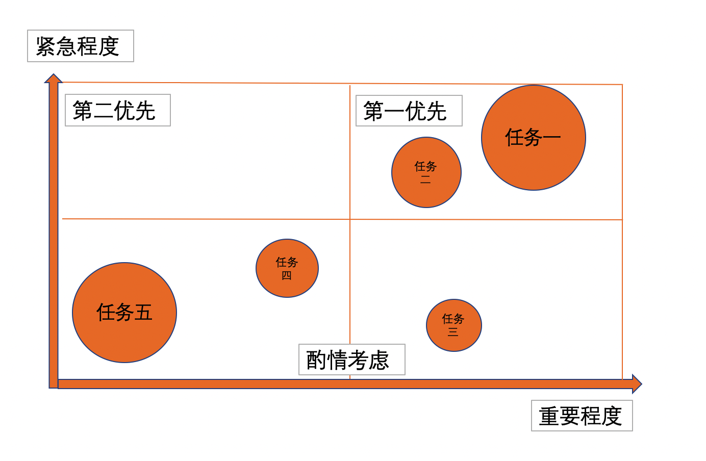
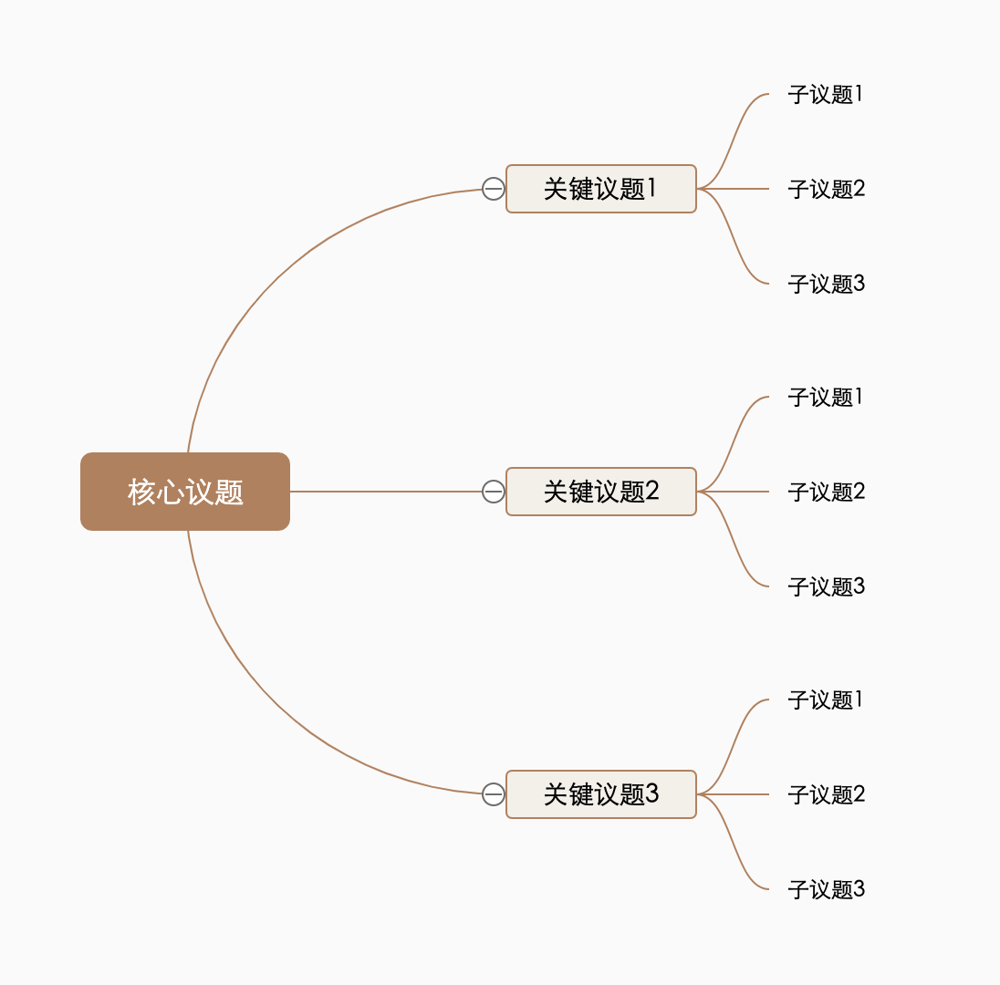
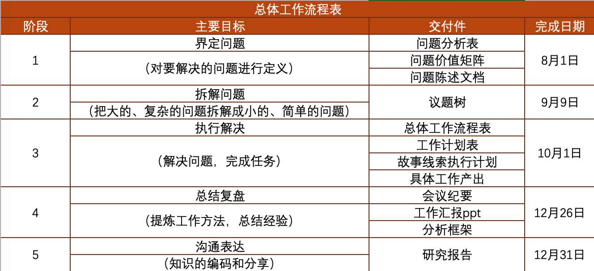
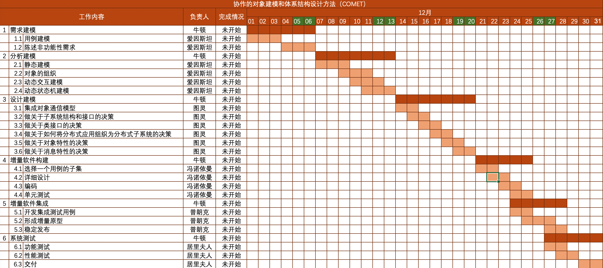

# 解决复杂问题的通用框架

我们通常将解决问题的能力作为衡量一个人个人能力的一个重要指标。一个人一生中经历的各种大大小小的问题通常可以简单分为两种，一种是简单问题，一种是复杂的问题。所解决的问题的复杂程度是与人的能力大小成正比的。然而我们往往在工作和生活中发现很多人解决简单的、熟悉的问题的时候游刃有余，一旦遇到复杂的，自己不熟悉的问题，马上就开启了“拍脑袋模式”，然而靠拍脑袋想来办事，做事没有章法和结构，没有做到实事求是的调查研究，进而导致观点站不住脚，最后随意地做出决定。“拍脑袋想”的后果往往是“拍胸脯保证”，最后搞砸了“拍屁股走人”。这篇文章介绍了一种解决问题的思维方式，它能终结一遇到事情就“拍脑袋”的恶习。这种思维方式是一种保持内在一致性和逻辑性的系统化的连贯结构，这种结构与最终要达到的目标相结合，能够帮助问题解决者从混乱中理出头绪，并将复杂问题分解成若干个简单，可独立解决的小问题，识别其中的关键驱动因素，对其进行重点分析，最后解决。

# 1. 界定要解决的问题

要解决问题首先要搞清楚问题是什么，因此对问题的界定是解决问题的第一个重要环节。问题界定不清往往会带来后面的一系列困难。最典型的情况是前期问题定义模糊，造成后期无法确认工作是否已经完成了；其次是没有在一开始界定好问题，导致边界无限蔓延，最后导致延期。可以通过三个层次的工作逐步界定清楚问题，首先是通过做一点调查研究弄清楚相关专业术语；然后是通过一些工具来剖析问题的本质并判断问题价值；最后是通过SMART原则给出清晰的问题陈述。

## 1.1 熟悉和理解专业术语的内涵和外延

陌生的专业术语是界定问题过程中遇到的第一个拦路虎。问题研究者可以通过做调查研究的方法来学习一些专业术语，调查研究的方法分为两种：案头类研究和访谈类研究。案头类研究就是坐下来，通过阅读相关资料进行学习；访谈类研究则是走出去，通过与专家进行访谈来学习。最后，“what-else循环法”结合一些具体应用场景可以帮助问题研究者理解专业术语的内涵和外延。

### 1.1.1 案头类研究

做案头类研究的意义不在于获取尽可能多的信息，而在于尽可能快地获取最重要的信息。资料非常多，要全部收集齐再研读是不可能的，要做到有的放矢。可以通过搜索引擎和相关网站对定义有个大致了解，然后阅读专业机构出的研究报告，书籍和论文来进一步明确定义并了解该领域当前发展水平和重要课题。除此之外，官方机构、第三方研究机构和一些综合型数据库也是获取权威资料的渠道。

### 1.1.2 访谈类研究

访谈类研究主要是通过询问行业专家，以定量为主，定性为辅的方式提出问题并获取自己需要的答案。访谈类研究的方法主要就是用户访谈。进行访谈前要准备访谈提纲，访谈提纲能够提高从被访者获取信息的成功率，使大家时间得到充分利用。确定访谈问题的时候首先要明确以下几个方面：

1. 所问的问题是什么？
2. 真正需要获得的是什么？
3. 试图达到何种目的？
4. 为何采访某人？

要提前了解被访者，然后开始设计提纲，先从一般性问题问起，然后进行具体问题提问，可以加入一些事先知道答案的问题，这样做有两个作用，一个作用是可以对被访者做一定的诚实性检测，检验下对方的回答是否有水分；另一个作用是检查下对该问题是不是能找到尽可能多的答案。提纲的最后可以放一个收尾问题：是不是还有什么想告诉我的？写完提纲后，进行最后的检查，问自己：在访谈结束时，我最想知道的3件事是什么？检查无误后，提前把访谈提纲发送给被访者，让对方提前做好准备，节约大家时间。

进行访谈的时候，可以通过肢体语言表达兴趣，让被访者知道你一直在倾听，也要适当引导，保证访谈内容没有偏离主题。这里有一些保障访谈成功的秘诀。可以让被访者的上司安排会面，这样能引起对方的足够重视；访谈时两人一组进行访谈，可避免重要信息遗漏；访谈过程中不断复述，确认自己正确理解了被访者的意思；善用旁敲侧击的方法可以了解更多的信息，但不要问的太多引起对方的敌意；访谈的时候要尽量尊重被访者感受，不要过度侵犯个人隐私，可以通过告诉对方访谈的过程对对方带来的利益或分享一定的交换信息来减轻被访者的焦虑。

有时候，做用户访谈不得不处理一些棘手的困难。比如一些消极型的被访者，不正面回答你的问题，给出的回答都是你已经知道的内容，就只好找其他人打听想知道的事情，或找其上司反映情况。对态度强硬，拒绝配合的被访者，也要拿出强硬姿态，并忠于职守，完成任务。

访谈结束后，记得写一封感谢信，这样可以通过一点礼貌建立起长期良好的关系。

### 1.1.3 交叉验证信息

做完案头类研究和访谈类研究后，可以交叉验证关联信息之间是否有矛盾之处。可以通过不同类型信息来源获取同一信息进行交叉验证，也可以通过同一类型但通过不同渠道的信息来源获取的同一信息进行交叉验证。从整体上获得对相关信息的一个正确认识。

### 1.1.4 用“what-else循环法”理解专业术语

what-else循环法是一种通用方法，它通过不断的问what（这是什么？）和else（还有什么？）来理解专业术语的内涵及其外延，这个过程一直持续到无法提出新问题为止。

结合具体应用场景来举例，当我们尝试理解代表某种产品或服务的**产品型术语**时，需要明确其基本定义、定义的历史变迁和典型品牌等内涵；然后在研究其外延的时候重点研究纵向的产业链上下游（上游有哪些供应商？下游有哪些直接客户和最终用户？）和横向的关联产品（替代品）。

尝试理解涉及专业知识的技术型术语时，需要在明确内涵阶段了解其技术参数、技术应用方向、技术分支方向和当前技术的使用情况；研究其外延时研究与之相关的技术发展情况，如果技术已形成规模产业，也可以熟悉其产业链上下游情况。

最后，在尝试理解非产品、非技术类一般性名词的时候，需要明确其基本释义和应用场景等内涵，然后在研究与之相关或同一类的名词即可。

## 1.2 分析问题本质并判断问题价值

解决高价值问题的收获往往是很高的，但光凭感觉来分析问题本质并判断其价值大小是不够的，问题研究者可以通过诸如问题分析表和问题价值矩阵等工具来帮助理性分析。

### 1.2.1 剖析问题本质的意义

在界定问题阶段剖析问题本质首先可以聚焦问题本身，理解关键对象的目的和意图，并提出有针对性的建议，提高沟通效率；还可以确立解决问题的基本原则，在发生争议的时候回顾问题本质并进行化解；最后，剖析问题本质是判断问题价值的基础。

### 1.2.2 问题分析表

**问题分析表**有“3W”、“2S”和“1R”这6个要素，可以用来剖析问题本质。3W是“who+why+when”的缩写。**who**主要关注问题的提出者和利益相关方，例如获益方、受损方和资源投入方都有哪些；**why**主要关注问题的背景，比如经济环境、行业环境、发展趋势和公司发展方向，主要探索该问题为什么被提出来？问题背后的动机有哪些？利益冲突点是什么？关于利益冲突点，最好可量化以判断问题的严重程度，比如具体的销售收入增长率和客户投诉率等等指标；**when**则主要关注问题需要在什么时候被解决，即due date。

2S是“standard+scope”的缩写。**standard**即问题成功解决的标准，它对问题的解决有三个方面的重要影响，一是可以用于争取更多的资源和利益，二是可以明确问题提出人和利益相关方的需求，三是可以统一目标，避免后续工作出现反复。目标不能定的太大，太大的目标会导致资源投入太多，解决时间过长；目标也不能定的太空泛，过于空泛的目标相当于没有目标，因为不具备可操作性，最好有一定的量化标准：明确应该包含什么内容，或者明确一定的指标数据。比如系统性能提升X%，成本降低Y万元等等，比如明确研究报告应该包含什么内容，例如市场规模、发展趋势预测等等。**scope**表示问题解决的范围，明确解决范围可以确认问题的解决路径，防止无限发散和优化，也可以避免后续争议。最后的1R是“risk”的缩写，表示**风险**。进行一定的风险分析可提前识别一些可能遇到的风险，并避免盲目乐观。

在剖析问题本质的时候有一些诀窍可以保障顺利推进，比如始终让最重要的利益相关方参与，始终确保沟通渠道畅通，让参与问题界定的各方达成一致，反复迭代，并在必要的时候重新界定问题的范围。但要注意在问题界定过程中不需要知道所有问题的答案，这是后续步骤要考虑的事。

### 1.2.3 问题价值矩阵

如果要解决的问题不止一个，那么**问题价值矩阵**就是对问题价值进行排序的重要工具。它按照重要程度和紧急程度分为三块：第一优先、第二优先和酌情考虑。它与上面的**问题分析表**的基础上对问题进行重要程度和紧急程度的评估，并相应地估算投入工作量。评估重要程度时的重要依据是3W中的who和why；评估紧急程度时的重要依据是3W中的when；评估投入量时以圆的面积表示投入资源的多少，面积越大使用的资源越多，通过问题价值矩阵可以很清晰的看到解决哪个问题最具有性价比。

## 1.3 编写清晰明确的问题陈述

**问题陈述**是对问题本身和解决问题的方法的高度概括。它可以指明工作方向，方便团队成员快速抓住工作本质；明确问题边界，明确什么该做，什么不该做；有效避免纠纷，在工作方向产生分歧时判断正确方向。编写问题陈述要参考**SMART**原则：

1. 特定的（**S**pecific）：提到问题的关键点，表达为更加特定、具体的目标；
2. 可衡量的（**M**easurable）：用量化的指标描述问题本身和解决目标；
3. 行动导向的（**A**ction-oriented）：有明确的解决方向；
4. 相关的（**R**elevant）：陈述与初始问题必须密切相关；
5. 有时间限制的（**T**ime-bound）：必须有时间限定。

举个例子，比如我的目标是减肥，那么问题陈述为：“在3个月的时间内，通过合理规划饮食和参加体育锻炼，进行减肥，包括跑步、跳绳和游泳训练，目标是将体重控制到70公斤”。对照SMART原则检查下：

1. “3个月的时间内”满足T原则；
2. 减肥以及要进行的内容符合S原则和R原则；
3. “合理规划硬是和参加体育锻炼”符合A原则；
4. “目标是将体重控制到70公斤”符合M原则。

编写完问题陈述后，可以将问题陈述、关键点和风险点以邮件等方式分发并知会相关人员并固化结论。

# 2. 拆解问题

界定清楚了要解决的问题，接下来就需要在问题陈述的基础上展开问题，把大的、复杂的问题拆解成小的、简单的问题，这样可以降低问题的解决难度并多角度给出解决方法。并规划清楚问题的解决步骤和先后顺序，提前了解问题中的重难点，以便后续重点攻克。**议题树**是拆解问题的重要方法，下面介绍议题树的组成要素和搭建方法。

## 2.1 以议题树作为工具

议题树的第一层级是**基本问题**，即界定问题时形成的问题陈述；第二层级是**关键议题**，即关键性支柱，主干部分；第三层级是**三级议题**，是关键枝丫；后续第四、第五层级是更细节的议题。

议题树的拆解方向有横向和纵向两个方向。横向拆解将问题拆分成各个组成部分；纵向拆解对问题进行深度研究。议题树有很多表现形式：纵向议题树、横向议题树、辐射型议题树、表格型议题树和鱼骨图。但鱼骨图多用于总结复盘时分析产生问题的可能原因。议题树长的有点像思维导图，但不同的是它有它自己的两大基本原则。

### 2.1.1 MECE原则

**ME**是”**M**utually **E**xclusive“的缩写，表示相互独立，拆解出的子问题不能有重叠，重叠意味着思维混乱；**CE**是”Completely Exhaustive“的缩写，表示完全穷尽，没有遗漏，解决完所有子问题就意味着解决了原问题。比如对”人“进行分类，以下分类就是MECE的：

* 男人，女人
* 10岁以下，10岁-20岁，20岁以上

而下面这样分类就是不MECE的：

* 男人，女人，孩子

### 2.1.2 同一层面原则

同一层面原则包含**同一维度**和**同一层次**两重含义。维度是指思维的角度，比如对笔记本电脑的观察可以从功能的角度，也可以从外观的角度，这里的”功能“和”外观“就是不同的维度，同一维度就是要保证同一个议题下面的子议题都在一个角度上；而”层次“是指系统在结构和功能方面的等级秩序，比如助理和总监就不在一个层次上。拆解议题树的时候，一定要注意检查子议题，除了满足MECE原则，还要满足同一层面原则。

## 2.2 议题树的搭建方法

议题树的搭建分为三步，首先通过假设驱动法提出可行的假设，然后综合运用多种方法逐步拆解子议题，最后迭代修改并补充完善。

### 2.2.1 提出可行的假设

假设驱动法是对关键议题（关键驱动因素）所提出的可能的”答案“，这些”答案“明确具体，可以通过搜集事实加以证明或驳斥，其精髓在于在正式启动前就尝试根据有限的信息得出待检验的问题解决方案，因而可以提供思路，先设想出答案进行快速试错，提高搭建议题树的效率，然后可以在后文提到的自下而上法中补充细节，在自上而下法中补充关键议题。提出假设并解决问题的过程本质上就是一种科学的研究方法，它通过事实分析验证真伪，从而绘制解决方案路线图：通过**正确的问题**开展**正确的分析**，从而得到**正确的答案**。遇到以下情况，使用假设驱动法是最有效的：

* 遇事不决
* 无从展开
* 毫无头绪
* 无外界信息

假设驱动法的主要步骤只有两步：先提出假设，后进行QDT检验。可以使用**常识和直觉**提出假设，即多年来的仔细观察和经验积累锻造而成的本能；也可以通过对过往经验的提炼、重构和迁移来提出假设，即**经验与知识**；也可以**向他人求助**，即具备领域知识和经验的人；最后，还可以利用快速收集到的信息（即不求漂亮也不需要提炼的”基本事实包“）来提出假设。对提出的假设，可以进行一个QDT检验（**Q**uick-and-**D**irty **T**est），问自己一个问题：要证明你的假设，哪些假定条件是成立的？通过QDT可以快速地对多种方案做出评估。

使用假设驱动法有一些重要的经验规则。首先是**让假设决定分析**，即重点分析，在直觉和信息之间保持平衡。没有直觉的数据仅仅是原始信息，而没有数据的直觉只能是凭空的猜想，两者合二为一，就为合理决策奠定基础；其次是要**理顺分析的优先顺序**，不做与假设无关的分析，要快速制胜，先做易于完成，且对证明初始假设有重要贡献的分析；然后是**不要追求绝对的准确**，付出过量时间和精力，往往十之八九从大致正确走向精确错误，因此不要追求完美，只追求好于现有的东西，并立即行动，以后再不断完善。最后要**确定困难问题的范围**，即通过分析，划出答案的可能范围，只要方向正确加上范围恰当，最后很可能足以得出结论。

### 2.2.2 逐步拆解子议题

可以使用**自下而上法**和**自上而下法**对通过假设驱动法提出的议题树进行进一步拆解。自下而上法一般应用于不熟悉或者特别复杂的问题；自上而下法则通常在对基础问题所涉及的领域比较熟悉或有现成方法可以解决的时候使用。

#### 2.2.2.1 用自下而上法应对不熟悉的部分

运用自下而上法拆解议题树，首先要**列出所有能想到的散点**。这个时候往往需要依靠团队的力量进行集思广益，问题研究团队可以组织一个头脑风暴会议。会议要确定1个主题，一般持续时间60分钟左右，需要有1个主持人来引导发言并控制场面和讨论节奏，1个记录员记录要点，会后整理，另外还要有若干参与者，他们是参与这项工作的成员，必要的时候还要邀请有知识有经验的外援。组织头脑风暴会议的原则是以想法数量为最终目标，讨论过程中禁止批评和评论他人；参会人员一律平等，要进行独立思考，不要自我批评和自我设限；大家畅所欲言，任意思考，鼓励各种补充和引申。 如果条件不允许，需要一个进行头脑风暴的话，也有3个技巧能启发自己的想法。类似于”界定问题“环节中的”学习专业术语“，当完全没有思路时，可以借鉴既有资料，或者访谈专业人士来帮助打开思路，即**查询法**；或者当缺乏思路的时候，从日常生活入手，看能否通过类比的方式将熟悉领域的知识迁移到不熟悉的领域，即**迁移法**；最后，当应用完前两个技巧后，还可以通过思维的发散与收敛，找到与现有散点相关的更多散点，即**关联法**。

接着，**对散点进行合并归纳，总结出上一级议题**。方法就是找出各散点中最核心的特征，总结然后合并。要注意的是这一步最容易犯的两个错误，一个是错将相关关系作为归纳合并的依据，没有抽取出散点的共性和本质。一个是将非核心本质和无关紧要的因素当成了归纳结果。有时候，散点之间有多种共性，从任何一个角度归纳都正确，遇到这种情况该怎么取舍呢？这就要回到最初需要解决的问题上来确定应该选择哪种分类方式了，先回到问题本身，看看最初是要解决什么问题，然后再选择某种分类方式，或者某几种分类方式都尝试下，看哪种问题的解决途径最佳。在归纳的时候，要注意逐级向上归纳，不要跳跃步骤，否则容易偏离基本问题的方向。归纳完毕后，议题树的基本雏形就出来了，要进行一些小的修改和完善。首先可以利用同一层面原则对议题树进行检查：各议题是不是同一维度或者说同一套分类方法？同一层级议题是否都在同一层次上？可以通过升级和降级进行调整；最后利用MECE原则再检查下是否有重叠和遗漏。

沿着这个思路，将归纳总结出的议题进一步归纳，逐步形成议题树，并使用MECE原则和同一层面原则进行调整完善，议题树就搭建完成了。

#### 2.2.2.2 用自上而下法处理熟悉的部分

运用自上而下法拆解议题树，主要就是利用自己对问题的熟悉列出议题树的主干，比如**直接经验**，即对某个问题非常了解，处理过很多类似问题。也可以使用一些现成的**计算公式**，利用公式的核心部分搭建关键议题，再对公式中的要素进行进一步拆解。常见公式有：

* 销售额 = 销售量 * 单价
* 利润 = 销售额 - 总成本
* GMV（电商平台总交易额） = 用户数 * 转化率 * 客单价
* 广告收入 = DAU * 人均广告浏览量 * CPM（千次广告展示价格） / 1000
* 人均广告浏览量 = 人均信息流列表浏览量 * 广告加载率

有一种特别典型的方法是利用管理大师总结出来的各种**分析框架**来拆解问题，即套入分析框架并根据实际情况修改。比如战略分析领域，有SWOT模型、波特五力模型和波士顿矩阵；用户研究领域，有KANO模型、客户旅程和净推荐值；财务分析有杜邦分析法等等。

还有一种拆解议题树主干的方法叫**逻辑结构法**，即根据逻辑特征进行分组，常见的逻辑结构法有二分法、步骤顺序法和构成要素法三种。**二分法**可以按照某种特征将问题拆解为两个部分，即“是”和“非”。当问题并不陌生但一下子找不到头绪时，可以将问题拆分为“A”和“非A”两部分。使用二分法首先要找对标准，一定要根据要解决的问题来决定如何二分；其次是逐层二分，补充细节内容时如果仍然没有思路，仍然可以通过二分法继续拆解下去；最后，拆解过程中经过MECE原则和同一层面原则的修改和完善，二分法产生的议题可以进一步细化，甚至可以将议题三分或者四分。**步骤顺序法**按照某种时间顺序或步骤顺序对问题进行拆分，这个方法常用于解决实践性比较强的任务，拆解出来的步骤可以直接用来写工作计划。**构成要素法**则是将问题拆解成某种直观结构或者组织结构，是一种整体和部分的关，也比较常见。

议题树的主干弄清楚后，关键议题的拆解就完成了，最后要采用同样的方法对关键议题进一步细化补充，并使用同一层面原则和MECE原则进行补充完善。

### 2.2.3 补充完善

基于可行的假设，使用自下而上或者自上而下法拆解出了议题树，要进行最后的整体补充和完善。首先，使用**8020法则**进行检查：关注那些能产生80%结果的20%核心要素，衡量议题树中每一个议题的投入和产出，专注于高产出的议题，忽略高投入、低产出的议题。这个法则看起来简单，但其实做起来有点反人性，人性是贪婪的，是面面俱到的，容易在细节上花费大量时间，但大方向上没把握好。问题的研究者在解决问题的过程中一定要提醒自己要果断舍弃那些得不偿失，费力不讨好的问题。

**议题树的搭建不是一个静态过程，是一个动态过程**。既然是一棵“树”，它就有自己的生长规律。解决问题的过程中，要根据不断变化的实际情况和对问题理解的深入不断迭代和修改，使主观符合客观。

# 3. 执行解决

界定好要解决的问题并拆解出议题树，说明问题的研究者对问题本身有了较为深入的了解，这种深入的程度已经到了可以上手解决的地步了。然而到了执行解决阶段并不是上来就开始做，议题树只回答了“要解决什么问题”，要知道“如何解决问题”，就要根据议题树做好计划安排和人员分工，然后才是工作执行。

## 3.1 计划安排

计划安排的目标有两个，一个是**提高效果**，即做正确的事；一个是**提高效率**，即把事情做好。做计划安排时最容易出现三种错误。一个是围绕错误的事情分工，或者没有理出侧重点；一个是不考虑工作量的多少和各类问题对最终成果造成的影响，平均分配任务；还有一个是缺乏用来检验所做假设的工作计划，即对于暂时还不清楚的地方没有安排任务来了解清楚。这些都是做工作计划时要特别注意的。计划安排需要分解成一系列步骤逐步制定完善。

### 3.1.1 制定总体工作流程

首先，要制定一个全局的总体工作流程，它回答以下4个问题。第一个问题是总体上需要完成哪些工作？即解决问题的过程在大体上分为几个阶段；第二个问题是最终结果如何？即每个阶段的交付物有哪些；第三个问题是什么时候完成？即问题解决的工期是多久。总体工作流程一般构建成一张表格，如下所示：

### 3.1.2 制定具体解决方案

如果上一步骤中拆解出来的议题树每个议题都是要执行的具体动作或工作的具体内容，这种议题树就叫**行动导向型议题树**，也称为**解决方案型议题树**。这种议题树会直接告诉你“做什么”和“怎么做”，只要补充如何完成这项工作的细节，它就可以形成完整的解决方案。然后解决方案就可以按步骤整理成解决方案清单，整理的过程中要一一拆分清楚，避免忽视相关工作量。特别是需要从多个角度入手的任务，以及需要与多个团队、部门和人员沟通的任务。

另一种以问题为导向进行拆分得到的议题树，叫**问题导向型议题树**。这种类型的议题树每一个子议题都是一个问题而不是步骤，不能直接作为解决方案使用，需要重新进行总结和提炼，才能形成解决方案。具体步骤是，首先针对每一个小议题制订出对应的解决方案，需要多动作，跨部门沟通的任务尽量拆解详细；然后归纳总结解决方案，对横跨多个议题的重复或相近的解决方案进行整合；最后修改和完善解决方案清单，按步骤顺序从上到下，从高到低梳理清楚解决方案清单。得到了解决方案清单，才能在清单的基础上制订工作计划。

### 3.1.3 制定工作计划

工作计划包含5个要素。**工作内容**包含按照解决方案清单罗列的任务列表；**资料来源**给出在什么地方能找到完成任务所需的原始材料；**工作目标**指定每一项工作最终实现的成果；**人员分工**确定由谁负责，由谁执行；**时间进度**确定一项工作需要多长时间完成，其中要特别注意列出汇报点和复盘点等关键时间点。

制定工作计划有两个重点，一个是要考虑统一申请资源需求，包括人员、资金、设备、技术和权限等因素；一个是风险预估，考虑如何缓冲风险的影响。

制定工作计划有4个具体步骤。首先要确定各项工作的目标并估算工作量，其中重要的工作目标一定要规定明确，要进行一定程度的“高估”来提供缓冲。其次要对各项工作进行排序，即按重要程度确定好先后顺序。然后确定时间规划，把各项工作指派给各个模块的负责人，指派负责人的时候要考虑工作的性质，对于有大量重复动作的工作，可以通过增派人手来完成；而需要连续性思考和分析的工作，必须指定同一个团队甚至同一个人来完成。然后要特别注意项目汇报或系统上线这种关键时间节点，有三个注意事项：（1）要学会“上保险”，针对重要工作考虑留一个补救时间作为缓冲；（2）要注意“负载均衡”，不要让某个成员太忙或者太闲；（3）一定要“并行执行”：同时开展好几项工作，抢时间进度。最后通盘考虑可能出现的所有风险，提出相应预案。

## 3.2 工作执行

经过上面一系列步骤的界定、拆解和计划，终于到了真正可以上手执行的阶段了。然而行百里者半九十，执行阶段仍然容易犯错误，出问题。比如解决方案运用错误导致错误的结果；或项目遇到了风险，没能有效实施预案；或项目中途换人导致动荡。有一些方法和原则，可以为工作执行阶段各项任务的顺利开展保驾护航。

### 3.2.1 将工作计划作为强大武器

要在工作计划中对之前提出的假设进行验证，进而根据情况优化完善。要验证假设就要具备一定的能力。一个是理解能力，要能明白各项分析的意义：如果证实了假设，那么就要弄清下一步该采取什么行动；如果证伪了假设，就要重新设立与事实相符的假设，修改假设，而不是隐瞒事实。另一个是提炼能力，即利用丰富的想象力把互不相干的事实连贯成有机整体，形成最终产品，也就是“创造力”。

要定期追踪进度。周报、双周报和月报是跟踪进度的常见形式。利用这些工具跟踪进度时一定要详略得当，重点突出，不要过于详细，让人很难抓住重点；要目标明确：敢于暴露风险，寻求资源和帮助，不要过于形式化，与实际工作不符。可以制定定期报告的模板，确定项目中最关键的指标，然后以关键指标为中心制定模板，有针对性地进行汇报，其他一些不重要的内容可以保持灵活性，自由发挥。

非正式的不定期进度沟通也很重要。对于项目组成员，不定期沟通可以建立信任、获取指导并分配相应资源；对于项目负责人，可以随时把控全局，最早、最快地发现问题，并指明正确方向，尽早应对风险。负责人要主动找项目成员沟通，消除畏惧感，并在此基础上揣摩工作计划，时间分配是否合理？进度分配是否合理？人员分工是否合理？资源是否欠缺？风险是否存在？

要及时发现问题并补救。类似项目延期、工作方向发生偏移和工作方法错误等一系列执行性问题，要及时提出补救措施，避免更大问题，并分析背后原因，识别根本原因，然后彻底根除。对产生风险、临时改变目标这类系统性问题，要利用风险预案进行对冲，必要时对工作内容重新分析安排。

### 3.2.2 把握关键原则

首先要保持畅通的沟通。工作中营造轻松的沟通氛围，用轻松的环境影响项目成员，少批评，多鼓励。要广开言路，积极通过电话、微信和邮件进行组内沟通，并与上级领导、客户和合作伙伴进行外部沟通。其次是对利益相关方进行分类管理，确定各角色和重要性，制定沟通计划，确保及时沟通避免疏漏。还可以通过建立公正透明的奖惩机制或者使用一些项目管理工具来提高效率。

### 3.2.3 提高个人执行力

执行力是指贯彻战略意图，完成预定目标的操作能力。团队的执行力是建立在个人的执行力之上的。掌握一些原则和方法，能够有效地提高个人执行力水平。

提高个人执行力有三个原则。首先，不要逃避问题，尤其是不要给自己设置各种心理障碍。比如缺资金、没人脉、没时间、时机未到或能力不足，提高自己应对害怕失败、恐惧挫折等心理暗示的能力。一个行之有效的方法是先摘好摘的果实，把能做的都做了，即在规划好的前提下，先把可以迅速完成的事情做好，完成几个小目标有助于迅速进入状态，建立自信。遇到困难要有死磕精神。不怕一切困难，不怕和自己过不去，有些难题是真的需要走出舒适区，“死磕+死扛”的。其次，一次只做一件事，不要事必躬亲。没有带动团队一起解决问题，就是浪费资源。况且什么事情都做会让周围的人对你抱有不切实际的期望，如果没有满足这些期望，想要再重新获得信任就很难了。最后，要以大局为重。事情再多也要理出头绪，不要被众多待办事项淹没。搞清楚要解决的问题，审慎评估手头工作，只做离解决方案更进一步的工作。

还可以使用一些方法来提高个人执行力。问题的研究者要养成平时多思考的习惯，通过进一步思考解决始料未及的难题。合理利用时间，利用整块时间系统性思考，利用碎片时间对细分议题深入思考。可以充分完善“故事线索”，形成执行计划，这是一种在工作执行阶段执行计划的，巨细无遗的大纲，精确到每一个动作甚至几点几分，用于指导最终产品的具体构建步骤。此外，可以用番茄工作法一类的任务管理工具，给自己施加一些外力，逼自己保持专注。

# 4. 总结复盘

工作要以结果为导向，毕竟最后的产出物代表的是工作的成果。然而问题的研究者也要重视过程，因为解决问题过程中总结经验教训的环节对于不断的提高工作效率有着非常重要的意义。在工作的过程中进行总结复盘，可以修正前进方向，及时止损；在工作结束后进行总结复盘，可以提炼工作方法，总结经验。熟练掌握复盘技巧，可以帮助问题研究者提高工作汇报水平，总结方法框架。

## 4.1 事中复盘

事中复盘是工作进行过程中的总结反思。针对持续时间超过两个月的大型项目，可以每半个月或一个月组织一次，每次组内复盘2小时左右，如果需要向组织汇报则要留足准备汇报材料时间；针对没有把握一下子做好的不熟悉的复杂工作，每周组织一次快速复盘，每次半小时到1小时左右。

复盘的重要意义之一，是**拨乱反正，不忘初心**，在大型项目工作推进过程中，可能会陷入细枝末节，而忽略了最开始的目标，新加入的成员对工作目标和方法理解可能不够充分，事中复盘可以回顾和明确项目目标，强调工作方法和计划，有助于团队内达成共识，确保工作顺利推进；复盘的重要意义之二，是**发现项目中的重大疏漏**，改进工作方法，提高工作效率，及时补救错误；复盘的重要意义之三，是**让利益相关方充分了解当前进度**，提出意见。

## 4.2 事后复盘

事后复盘是工作完成后进行的总结，它的重要意义在于及时发现工作中的不足，从而进行补救和改进，且窗口期很短，是最后的补救机会了，此外更重要的是总结经验教训，沉淀工作方法和流程，形成规章制度。对于新工作，总结方法和规律，进行知识沉淀，那么以后类似事情可以直接复用；对于比较熟悉的工作，则可以优化工作方法和流程，简化不必要的环节；最后还可以发现新的机会点，挖掘新机会，形成新的方向。

事后复盘可以组织多次，每次侧重点不同。对于**汇报工作+迅速补救**型事后复盘，可以组织专门的讨论会和汇报会；对于**规章制度+管理流程沉淀**型事后复盘，可以引入公司相关职能部门共同讨论；对于**挖掘新机会**型事后复盘，需要更多的讨论以及与领导的沟通，决定是否对新机会点做更深入探索。

## 4.3 如何做好总结复盘

总结复盘一般都是以组织一场团队复盘会的形式进行的。开会之前要做好妥善的会议安排，先要确定会议的目的和主要目标，定好主题范围。一般一场复盘会在45-90分钟左右，宁可多开几次，也不要让一次会议时间过长。要做好会议的后勤管理，订好会议室，确认设备可用，然后通知参会人员。

开会的过程中要把控好复盘会进程，会议组织者做好各项准备后，提前进入会议，会议开始时简单介绍下议程，重点强调特别想完成的议题，然后介绍外部专家。讨论的过程中把握好讨论方向，不要让话题偏离主题太远，但也不要太死板。要避免某些参会者过于执着，不愿理解别人的观点。也要留意是否有人没有积极参加讨论。最后，对重要结论要做出决议，并保证与会者清楚决议。可以通过询问或总结的方式保证最后决议有明确时间约束和任务分工职责。复盘结束时，要确认下次复盘会主题、时间及地点，安排记录员记录重要结论，并以会议纪要的形式发给与会者。

了解完总结复盘的大致流程，下面重点介绍一下总结复盘的四个步骤，即“回顾目标”、“评估结果”、“分析原因”和“优化改善”。

### 4.3.1 回顾目标

回顾工作目标主要做的就是在关键节点上回顾一下目标和计划，确认一下当前的资源。首先，回顾一下问题陈述，先展示最终版的问题陈述，然后以S-M-T-A-R的顺序，用SMART原则对问题陈述进行解析。然后回顾议题树，展示最终版本的议题树，确保理解各项议题。最后回顾工作计划，重点回顾工作内容、工作目标、人员分工和时间进度。上述步骤必须按顺序执行，千万不能有步骤跳跃，也不要轻易修改问题陈述、议题树或工作计划。一定要确认与会者对问题陈述、议题树和工作计划理解的一致性和准确性，因为它们是复盘的基石。

### 4.3.2 评估结果

评估结果包含对工作结果和工作流程的评估。对工作结果的评估仍然围绕问题陈述、议题树和工作计划表来完成。这个过程回答以下问题：工作是否达到预期结果，并按时保质完成？首先，以S-M-T-A-R的顺序评估问题陈述：

* **S**pecific：整个工作过程是否确实是朝这一方向努力的？当前结果与最开始目标是否吻合？
* **M**easurable：对比最终成果与这一指标的差异，是超额完成，还是有所欠缺？
* **T**ime-bound：确定工作是否符合既定时间限制，有没有延期发生？
* **A**ction oriented：确认工作是否按照既定的动作完成？
* **R**elevant：过程中是否做了与工作无关的事情？

然后围绕各个子议题判断是否完成来评估议题树。如果总体项目没有得到很好解决，检查哪些议题没有圆满解决；否则如果整体项目完成情况比较好，则挑一些核心议题做重点评估。在实操过程中，可以针对每个议题逐一做“是”或“否”的判断。

最后是对工作计划的评估。结合议题树评估4大对象：哪些没有完成的议题分属于哪些工作项？由谁负责？是按时完成还是有延期？重点工作目标完成情况如何？评估的时候做好控场，注意力要集中在事情上，而非责任划分上。重要的是发现问题并解决问题，一定要避免甩锅、争功、辩解和相互指责的现象发生。

对工作结果的评估结束后就是对工作流程的评估。首先评估问题陈述是否准确，是否符合SMART原则；然后评估议题树的拆解思路，是否符合MECE原则；最后评估工作计划的分工是否合理，以及时间安排是否合理。

分析完工作结果和流程，要总结归纳，把真正的问题找出来。有几个原则一定要把握。要找到源头问题，一个任务的延期或者没做好，很可能导致另一项任务的延期或者没做好，是真的存在因果关系，还是有人在推卸责任？

问题必须清晰化。可以将结果和目标比对，发现差距。描述问题时尽量量化，本身有量化指标的要用量化指标；本身没有量化指标要用量表，比如满意程度和努力程度，就可以用1分到5分来衡量和评估。表述一定要清晰，避免模棱两可，也不要有遗漏。

要聚焦问题本身，而非其原因。否则无法聚焦事件真实属性，无法发现真正问题，或方向出现偏差。或者导致片面而不深入，限制后续工作的开展，分析原因应该是后面的事。

### 4.3.3 分析原因

**鱼骨图**是分析原因的实用工具，它是思维导图的一种特殊形式。鱼骨图的作用是表明问题产生的原因并指出影响问题解决的因素，帮助决策者对问题进行整体把握。画鱼骨图时，先列出需要解决的问题，写在鱼头处，然后尽可能多地通过讨论找出问题出现的可能原因，最后把相同问题分组，在鱼骨上标出即可。

有一些工具和方法可以配合鱼骨图使用。**5why分析法**连续不断地问“为什么”，直到本质原因为止，这种方法找出有效长期对策，而非短期应付方案，因此可以深入系统地挖掘问题根本原因，所有分析结果一定要落到可操作层面，并坚信所有问题都可以被解决。

**人机料法环**法适用面比较窄，只适合针对生产企业的管理问题。它考虑人、机器、物料、方法制度和工作环境5个因素。**人**是整个生产运营过程中各级工作人员，是最核心因素；**机器**是影响生产进度和产品质量的重要因素；**物料**表示多种产品用料完美配合；**方法制度**则是指生产过程中所遵循的方法；**工作环境**指环境和氛围。

类似的**人事时地物**常用于管理问题的分析。它同样考虑5种因素：人、事、时、地和物。**人**泛指需要被分析的对象：自然人，组织和公司等；**事**则是指事件、事件性质或事件群；**时**是时间的跨度；**地**是指办公环境，整体文化，价值观，领导风格和相处模式；**物**表示所有的资源和流程机制，以及整合利用情况。

总结分析原因的过程中要避免三类问题。不要习惯性地把原因归结于客观原因而非主观原因，自我认知存在盲区，看不到自己身上的缺点和不足；不要将问题和解决方案混淆，随随便便提出一个解决方案，思路就会变窄，无法深入思考；分析得出的原因不要过于笼统，否则后续会感觉无从下手。

复盘是一个痛苦的过程，要剖析自己，自揭伤疤，所以一定要做好心理建设。尽量打造相对轻松的氛围，比如封闭的环境，轻松的语言，强调与绩效考核结果无关的承诺。项目负责人带头剖析自己存在的问题和背后的原因。

### 4.3.4 优化改善

回顾目标，评估结果和分析原因的最终目的，是为了优化改善。针对工作结果的优化改善，对于能够迅速解决的原因，要直接制定工作计划，安排人手解决；工作方向或方法的不足，要修改议题树及工作计划，一边修正一边前进；针对系统性原因，比如改进工作流程或公司制度，要在事后复盘中再讨论是否要启动一个新工作项目。

针对工作流程的优化改善，在事中复盘时，对问题陈述、议题树和工作计划进行修改，按更新后的方案推进工作；在事后复盘时，为下一次项目的“四步法”流程吸取经验教训，打基础。

## 4.4 高级应用

总结复盘的直接输出结果，要么是一份完美的汇报，要么是一套分析框架。前者可以用来向相关干系人进行汇报，后者是总结提炼出来的解决问题的思想武器。

### 4.4.1 完美汇报

一份完美的汇报一定是结构清晰，简单明了的。首先通过回顾定基调，第一页回顾最初设定的任务目标，第二页展示在这项工作中取得的关键成果，特别是突出成果超过目标。其次评估每一个重点工作项，用了什么思路？采用什么方法？最后实现什么结果？最后在收尾部分分析并改善，针对没有完成得很好的工作，解释根本原因，提出补救措施；发现新的机会点，有意继续向下探索，希望得到领导支持；提出流程、工作方法，推广应用。

对于一次完美的汇报有一些重要的经验原则。最重要的原则是一定要事先沟通，避免出人意料。这样做可以事先检验汇报，让对方认可你的观点，让对方指出汇报中忽略的东西。其次是要注意量体裁衣，根据不同的对象调整自己的汇报，做到随机应变，尊重听众。最后要注意措辞，一方面确保呈现自己的业绩，另一方面避免被其他同事误解抢功，对于自己工作的不足要委婉表达，并在会后进行优化改善。

### 4.4.2 总结分析框架

这是总结复盘中最有意思的产出。总结分析框架有三重境界。境界一：从已有框架出发，总结通用工具，扩大其应用范围。首先明确想要通过这个分析框架解决什么样的问题。其次进行议题树拆解，基于现有框架中那些要素把议题树补充完整，根据实际情况进行删减和调整，对不符合MECE原则和同一层面原则的地方进行调整。再次，代入实践，补充细节，一个科学完整的分析框架需要无数细节支撑，包括分析框架本身细分内容，以及相关方法、原则和技巧。最后，给分析框架命名。

境界二：从已有框架出发，探索单一特定领域的解决方案。环节同上，也是明确目标，然后通过议题树总结提炼，实践补充细节，最后命名。差异体现在议题树总结提炼上，要基于这一领域特点进行细化和提炼，把通用方法改造转化成特定领域方法。

境界三：直接从总结复盘中提炼出分析框架，从0到1创造。环节仍然和上面相同，但这个最难，只适用于之前没有现成框架的领域，要多阅读相关领域书籍，不要重复发明轮子。不要妄想通过一个项目、一次工作就能提出一套分析框架，要多次工作后总结提炼共通点。总结出方法后，不要着急直接投入新工作中，仍然要从头搭建议题树，进行比对和交叉验证，多次修正后再投入使用（包括配套的各类细节）。

通过界定问题，拆解问题，然后解决问题，最后总结复盘，问题的研究者形成了解决问题的一个闭环。这个过程会积累一些知识，做好知识管理也是工作中的一个重要环节。最后，来谈谈如何通过沟通表达进行知识的管理。

# 5. 沟通表达

沟通表达是一项重要技能，毕竟满腹学识也要输出出来与人分享。然而清晰的沟通表达能力并不是与生俱来的，是需要一定的训练的。麦肯锡第一位女咨询顾问芭芭拉明托女士在《金字塔原理》一书中介绍了一种系统化的沟通和表达的方法，不仅适用于口头表达，同样也适用于书面表达。

知识管理的本质是沟通表达。知识是由数据和信息构建得来的。**数据**是事实，是观测结果，是具体数字；**信息**是对数据的收集和综合；而**知识**则是信息、经验和背景的增值整合。存在于人脑中未编码的知识，通过口头讨论和书面文件进行编码，然后可以与他人分享。所以沟通表达就是对知识的编码，由此问题的研究者可以不做重复劳动并利用前辈的经验，然后将自己的知识输出以指导后人。

## 5.1 为什么沟通表达要呈现金字塔结构

呈现金字塔结构的沟通表达结构具有以下特点：

* 结论先行，以上统下
* 归类分组，逻辑递进
* 先重要后次要，先总结后具体
* 先框架后细节，先结论后原因
* 先结果后过程，先论点后论据

通过对要表达的内容进行归类分组，可以找出逻辑关系，抽象概括成相关联的金字塔结构，构建金字塔群。自上而下表达，结论先行：先提出总结性思想，再提出被总结的具体思想。自下而上思考，总结概括：句子组成段落，段落组成章节，章节组成文章，各组成单元之间有一定逻辑关系，表达单一思想。

文章中任一层次的思想必须是其下一层次思想的概括。总结句要避免使用“缺乏思想”的句子，比如“3个结论”、“6个观点”这样的描述，就很糟糕。缺乏思想的句子难以持续吸引读者的注意力，会掩盖思考不完整的事实，错失进行有逻辑性和创造性思考的绝好机会。沟通表达只有**演绎法**和**归纳法**两种最基本的演进形式。演绎法是通过推理做进一步评论，而归纳法则是通过总结概括找出与之类似思想。归纳法既可以概括**行动性思想**也可以概括**描述性思想**。

概括行动性思想要说明采取行动的结果/目标，即告诉读者做什么事。在将各项行动（步骤、流程等）联系起来之前，先用明确的语句描述各项行动（步骤、流程等），然后想象自己确实采取了这些行动，根据完成这些行动产生的结果修改各个步骤的措辞，使之更明确和具体。每一个思想都必须与其同组的其他思想相互排斥没有重叠，每组中的思想对于上一层概括它们的思想而言，都必须完全穷尽没有遗漏，也就是上面所说的MECE原则在沟通表达时的具体体现。对目标/结果的表述必须非常明确，明确到能够以某种明确的方式判断是否实现目标，就好像最终结果就掌握在手中一样，否则无法判断列出的行动步骤是否包括了所有应当包括的步骤，可以检验修改后的句子是否能够使大脑产生某种“图景”，让人“看到”来判断表述是否明确。对于复杂的结果或目标其行动和步骤可能是多层次的，不能扁平化看待。否则行动和行动造成的结果会相互混淆，给读者造成巨大的理解困难。要找出明显的因果关系组合区分行动、步骤的层次，避免读者把原因和结果置于同一个层次上。首先要区分各项行动的层次。只是在时间上先采取的另一项行动与其他行动处于同一层次；而采取某项行动引出另一项行动则说明前者比后者低一个层次。然后要将每个层次上的行动、步骤控制在5个以内，这样更容易看清某一过程总体结构，在概括结果、目标时简化行动、步骤。最后要注意不要过度使用分类的方法，组织各种行动、步骤等唯一合理的方法，就是根据其产生的结果来归类分组。从这些行动、步骤、流程来总结、概括行动的结果及目标，措辞必须明确、具体，带来可操作性，否则就是毫无意义的口号。

概括描述性思想主要是为了找出各结论之间的共性，即告诉读者关于某些事的情况，或者提出一个新思想来说明这些思想之间的共同点所具有的普遍意义。有三种概括思想的技巧，首先要找出将这些思想联系在一起的结构上的共性，如果一组句子主语完全相同，就找谓语之间的共性；如果一组句子谓语的动作或对象完全相同，就找主语之间的共性；如果主语和谓语都不相同，就找句子隐含的思想之间的共性。其次寻找这些思想间更密切的联系，找到概括性语句的价值是可以帮助作者发现自己的真实思想，因此可以应用逻辑顺序的概念检查是否有问题被遗漏。最后完成归纳跃进，概括出主题思想，有时候很难看出一些具有共性的句子所隐含的意义，这时就要想象一组思想之间关系的来源，将隐含的意义明确呈现出来。

每组中的思想必须属于同一逻辑范畴，且必须按逻辑顺序组织。也就是上面提到的演绎顺序（大前提-小前提-结论）和归纳顺序，即步骤顺序（时间）、结构顺序（空间）和程度顺序（重要性）。

## 5.2 金字塔原理的内部结构

金字塔原理的内部结构只有纵向和横向两种关系。纵向关系比较简单，就是通过疑问—回答式的对话传递新信息：每一个表述都引发读者疑问，然后在下一层次横向回答读者疑问。横向关系主要就是演绎推理和归纳推理的各种具体细节，以及一种被称为“外展推理”的技巧。就书面表达来说，序言是吸引读者和抓住读者的关键，它本身有一些方法和结构需要掌握。

### 5.2.1 演绎推理

演绎推理的过程，首先阐述世界上已存在的某种情况，然后阐述世界上同事存在的相关情况，最后说明这两种情况同时存在时隐含的意义，其中第二则表述一定是针对第一则表述的主语或谓语的评述，这就是经典的“三段论”。或者采取另一种方式，先提出出现的问题或存在的现象，然后说明产生问题的根源，原因，最后给出解决问题的方案。但要注意，演绎推理论证过程琐碎，不赞成在写作过程中过多使用。关键句层次尽量避免使用演绎法，用归纳法取代，并尽量把演绎推理放在金字塔结构较低层次上。

### 5.2.3 归纳推理

归纳推理是一种创造性思维，它发现若干事物的共性并将其归结到一起加以说明。成功使用归纳推理的必备技能需要能正确定义一组思想，并准确识别并剔除不相称，不属同类，无共同点思想。使用归纳推理的具体步骤是找到一个能概括该组所有思想的名词，然后通过自下而上提问的方式检查推理。

归纳推理有三种主要的逻辑顺序：程度顺序，时间顺序和结构顺序。程度顺序好理解，就是先重要后次要的顺序。时间顺序是行动步骤或关于行动的想法（建议，目标），就像上面所说的，应用时间顺序要区分原因和结果，根据结果寻找原因，将多个层次上的原因和结果归纳整理到不同抽象层次上，形成“总过程—子过程”结构。这里再次强调，要避免因果关系错误，就要假设自己采取了各项行动，想象之后的结果，并判断某项行动在时间上优先于某项行动？还是为了实现某项行动必须先采取？

结构顺序将被研究的事物合理地划分为不同部分，首先运用MECE原则创建逻辑结构，做到相互独立，完全穷尽。结构顺序的划分可以综合应用上述顺序。可以根据活动本身，采取时间顺序来划分；也可以根据活动发生地点，采取结构顺序划分；也可以采用重要性顺序，根据特定活动的集合划分。最后以自上而下，从左向右的顺序描述逻辑结构。

所谓的外展推理，其实是一种特殊的归纳推理，它就是上面我们所提到的“假设驱动法”：先提出一个假设，然后寻找能够证实该假设的信息，一旦证实，推理过程就变成归纳推理。

### 5.2.4 序言的协作技巧

要采用讲故事的形式来展开序言，这样就可以让读者抛开其他思想，专注于话题。如果内容新奇、悬念并与读者本人相关，就能激发读者兴趣，吸引注意力。序言还有一个重要作用是确保引导读者按文章思路思考前和作者站在同一位置，与读者关系越近，序言篇幅可以越短。

一般来说序言采取的是SCQA结构，即背景（Situation）、冲突（Complication）、疑问（Question）和回答（Answer）。背景介绍上下文信息，将读者锁定在特定的时间和空间；冲突推动了故事情节发展的因素并引发读者的疑问：接下来会怎么样？最后整篇文章就是对读者疑问的回答。对于篇幅较长的文章序言还可以列出关键句要点来回答主题思想引起的新疑问，呈现文章的框架结构。序言有各种不同风格的变种：

* 标准式：背景—冲突—答案
* 开门见山式：答案—背景—冲突
* 突出忧虑式：冲突—背景—答案
* 突出信心式：疑问—背景—冲突—答案

要注意序言的目的是提示读者，而不是直接告诉读者解决方案。序言必须包含背景，冲突和答案，其长度取决于读者和主题的需要。常见模式有：

* 发出指示式：我们应该做什么？我们应该如何做？
* 请求支持式：我们是否应该这样做？
* 解释做法式：我们应该如何做？
* 比较选择式：我们应该做什么？

### 5.2.5 用金字塔原理构建结构化沟通表达

和议题树一样，构建结构化沟通表达有自上而下和自下而上两种方式。用自上而下的方法时，首先要**理清思路**，通过画出主题方框，说明要讨论的主题来明确主旨和正要回答的疑问，并表明答案或确定你是否可以回答此问题。其次要**构思序言**，即背景，如此会产生的冲突，冲突必然引发的疑问和疑问应该有的答案。然后要**找出关键句**，说明最顶端方框内思想引发的疑问，并决定采取归纳推理还是演绎推理，如果使用归纳法，请用单一名词描述分类时使用的观点类型并说明论点。最后**安排支持论点的结构**，任一层级思想都属于同一逻辑范畴，都必须按照逻辑顺序排列，上一层级思想应该是本层级思想的总结概括。用自下而上的方法时，先列出所有要点，然后找出各要点之间逻辑关系，最后得出结论。

注意在构建时最好先尝试自上而下法，并将背景作为序言起点，多花时间思考序言，不要省略这一步。序言仅涉及读者不会对其真实性提出质疑的内容，关键句层次上优先选择归纳法而非演绎法。

# 6. 后记

我是一个比较喜欢看书学习的人。书本不光给我知识，还赋予我战胜困难的勇气。作为一个程序员，我的代码思维已经不能帮我解决目前工作中遇到的问题了，我自己干活没问题，但是要我面对从来没遇到过的复杂问题，或者带领一支队伍去解决这样的问题，我就完全不知道该怎么去做了，这给我带来了非常大的痛苦。

既然爱学习，我就会关注一些学习的公众号，最早是在知乎上跟帖子，看别人的学习方法，然后认识了一个叫“高冷冷”的学习高手，关注了她的公众号，然后通过她的公众号认识了“在行一点”这个学习的App。后来有一天，我看到这个公众号推送了一个课程，叫《咨询管理顾问教你轻松解决问题》，讲师是Etesian老师，我就买了这门课来学习，觉得如获至宝，课程中介绍的解决问题的“四步法”非常具有实操性，其中总结复盘阶段提炼问题分析框架堪称神来之笔，因为软件架构师开发一套框架来解决问题的时候采取的也是同样思路。还是那句话，知识是相通的，《孙子兵法》上的很多道理，同样也可以用在软件开发中。

后来我又通过知乎联系上了Etesian老师，得知他最近要出一本新书，叫《掌控工作——从有序中获得效率》，于是我就买了这本书，边读边画思维导图，然后又重新看了一遍之前买的麦肯锡丛书以及《金字塔原理》，于是便有了这篇文章。写完这篇文章我主要读了以下五本书：

1. 《掌控工作——从有序中获得效率》
2. 《麦肯锡方法》
3. 《麦肯锡意识》
4. 《麦肯锡工具》
5. 《金字塔原理——思考、表达和解决问题的逻辑》

其中第一本书强烈推荐，Etesian老师提出的四步法是在经典的麦肯锡“七步成诗法“基础上总结提炼的，实操性很强。读完这本书后，可以再读读麦肯锡三部曲，就可以知道一般来说面对复杂陌生问题，都要经历一个界定和拆解的过程，且对于不熟悉的问题，先假设后验证不失为一种非常有效的方法，即先从有限的经验中得出一个大致的结论，然后用事实对它进行验证，最后得到解决方案。也能学会很多做案头研究和访谈研究的经验和技巧。结合具体的实践加以应用，一定能提高自己解决复杂问题的能力。写文章和写代码有一个相通之处，就是都能锻炼缜密的逻辑思维。最后的金字塔原理这本书最难，它教你用金字塔结构进行口头或书面的表达，内容比较深，我读了两遍都感觉没有完全吃透，还需要反复读。但是书中介绍的基本原则和方法，可以提高自己的写作水平，起码表达更清晰，读者更容易理解了。

