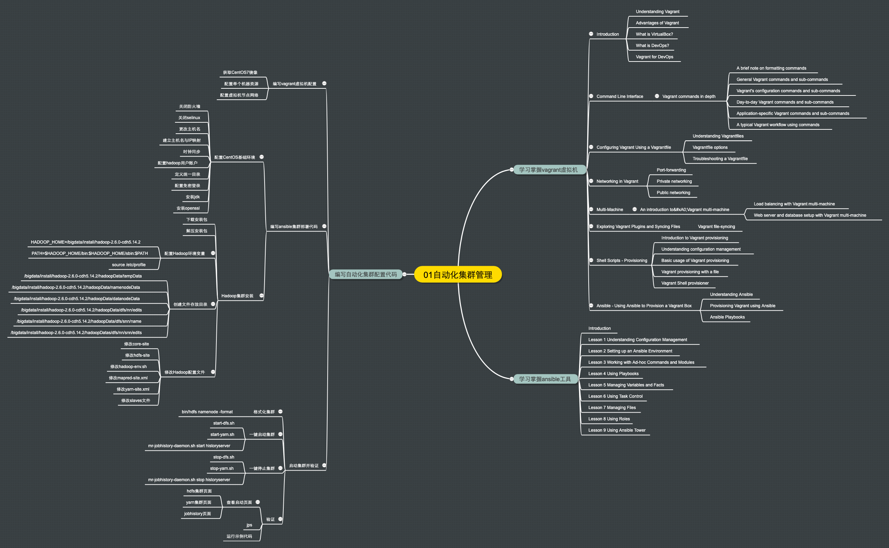

# 自动化集群管理

# 1. 问题定义

## 1.1 专业术语

* ansible自动化配置工具相关文档请参考[这里](https://docs.ansible.com/ansible/latest/index.html)
* vagrant虚拟机环境相关文档请参考[这里](https://www.vagrantup.com/docs)

## 1.2 问题分析

WHO：大数据软件开发工程师可以通过vagrant和ansible工具实现集群的自动化配置。通过”基础设施即代码“的方式将环境的配置固化成代码，使得该开发环境可以任意分发给其他的研究者，并在最短时间内启动基本的集群环境，以进行下一步的研究。

WHY：传统的环境安装方式是使用诸如vmware这样的虚拟机软件手动安装Linux发行版，然后在这个基础上手动进行一系列环境配置，然后进行手动的集群安装部署，最后手动启动，每次都这样操作一遍会耗费大量时间，如果这些工作能够被自动化，实现一键启动，就能一次配置，到处运行，极大地节约时间。

WHEN：在2个月时间内掌握ansible工具，并结合vagrant虚拟机实现。

STANDARD：熟练掌握ansible工具，并在vagrant虚拟机集群上实现Hadoop基础环境、Hive、HBase和Spark集群的安装配置，后面再遇到别的大数据集群环境时，也可以通过这套工具快速实现实验环境的部署，并将相关代码在Github上进行开源，供其他研究者使用。

SCOPE：要精通ansbile工具的使用；要熟悉vagrant虚拟机的基本配置；要能理解大数据集群安装的步骤，并能将其自动化

RISK：对于开发人员来说，对运维管理工具不熟悉，需要花时间学习；SSH免密登录的原理也不是很清楚，也需要查资料深入理解；环境的配置是一个长期的过程，要边学习边构建集群安装的自动化过程。

## 1.3 问题陈述

在2个月的时间内，通过深入学习vagrant+ansible工具和集群部署知识，开发大数据集群环境安装部署的自动化代码，包括Hadoop集群、Hive&HBase和Spark集群等，目标是实现基础架构既服务的自动化集群环境部署。

# 2. 拆解问题

要学习自动化集群管理，需要多实践。首先要掌握vagrant和ansible的基础知识，这个可以通过访问OReilly的在线数字图书馆来获取相关资料。之后主要的任务是编写自动化集群配置的代码。

首先要用vagrant配置基础的虚拟机环境，计划以CentOS7作为基础，用三台虚拟机组建一个私有局域网。然后使用ansible来编写集群部署的代码。首先是对CentOS基础环境的配置，包括关闭防火墙和selinux、修改主机名和配置用户账户等等。然后是hadoop集群的自动化安装，最后是集群的启动和验证，完成这些步骤后一个基本的环境就搭建好了。问题拆解得到的议题树如下所示。

